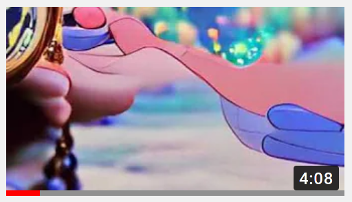

# aiVideoStitcher

 A partially-automated solution for creating music videos from AI-generated images based on song lyrics.  This is an initial proof-of-concept project, using [NightCafe's text-to-image generator](https://creator.nightcafe.studio/create/text-to-image)
Their service is relatively fast, produces good results, and is reasonably priced for small numbers of images. This makes it a very good choice for projects that require less than a thousand images and don't require much fine-tuned customization. If I decide to continue this project, I'll probably expand on this to create a tool that directly uses VQGAN+CLIP to generate video frames.

## Example output: Time Machine from Hawaii: Part II by ミラクルミュージカル \(Miracle Musical\)

## Instructions for generating this video:
I've included all the source images from my example video in this repo, so you can quickly try it out.
1. Install ImageMagick, FFMPEG, and Node.js. If you're not using Linux, you'll probably need to manually add all three of these to your system's PATH variable.
2. Download/clone this repository.
3. Get a copy of the audio track \(for sale [here](https://miraclemusical.bandcamp.com/album/hawaii-part-ii), support the artists if you can!\), and save it inside the aiVideoStitcher directory as timeMachine.mp3.
4. Run `createVideo.js`, and the video will be created as `timeMachine.mp4`.

## Instructions for creating your own:
1. Follow the first two steps from the instructions above.
2. Decide on the number of AI-generated images you want to use per second, the image size, and the source audio.
3. In a new text file, add timestamps to the lyrics of your chosen song, measured in seconds. Multiply those values by the number of images per second you're using. When generating image batches through NightCafe, use the line with the number closest to the number of images you've already created. Of course, if you're feeling creative, feel free to replace or enhance the lyrics with any other text you feel is appropriate.
4. Update `import.js`, setting `IMG_SRC_DIR` to the directory where you will be saving downloaded images.  Make sure you don't have any other images in this folder! If you don't plan on using the smallest image size NightCafe provides, you'll also want to update `WIDTH` and `HEIGHT` in the same file.
5. Start generating your first image on NightCafe. I used the track name and album as the first text prompt, with no initial image.
6. Once it finishes generating, open the set of progress images, and download them in order. Run the `import.js` script, and it will automatically move the images, name them, and create a scaled copy of the last image in the aiVideoStitcher directory.
7. Start a new image batch, using the `#_scaled.jpg` image created in the last step as the input image, and the appropriate line from the text file you created in step two as the text input.
8. Repeat steps six and seven until you've generated enough images to create your video.
9. Update the values near the top of `createVideo.js`, setting your input image size, input image rate, target FPS, the path to your audio track, and the path where your video should be created.. Also, set OUTPUT_DOUBLES_AT_IDX to -1.
10. Run `createVideo.js`, and the video will be created at the path you chose.

